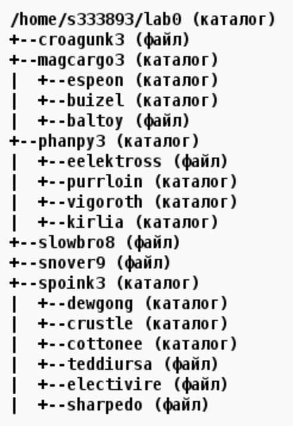
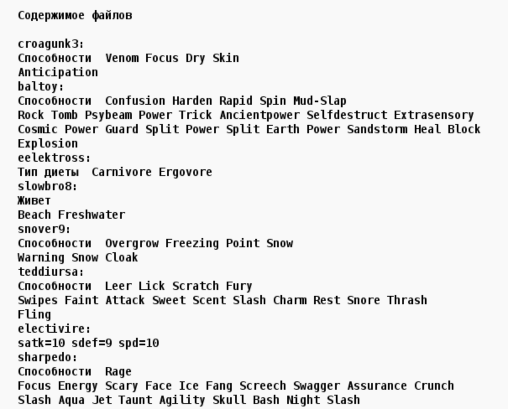

# OPD_lab1

### Текст задания:
1. Создать приведенное в варианте дерево каталогов и файлов с содержимым. В качестве корня дерева использовать каталог lab0 своего домашнего каталога. Для создания и навигации по дереву использовать команды: mkdir, echo, cat, touch, ls, pwd, cd, more, cp, rm, rmdir, mv.

2. Установить согласно заданию права на файлы и каталоги при помощи команды chmod, используя различные способы указания прав.
3. Скопировать часть дерева и создать ссылки внутри дерева согласно заданию при помощи команд cp и ln, а также комманды cat и перенаправления ввода-вывода.
4. Используя команды cat, wc, ls, head, tail, echo, sort, grep выполнить в соответствии с вариантом задания поиск и фильтрацию файлов, каталогов и содержащихся в них данных.
5. Выполнить удаление файлов и каталогов при помощи команд rm и rmdir согласно варианту задания.

